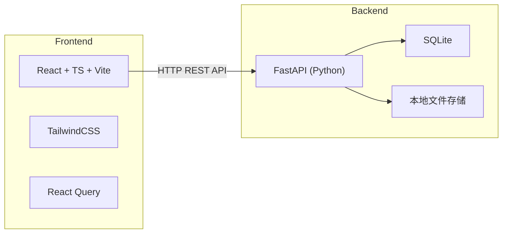
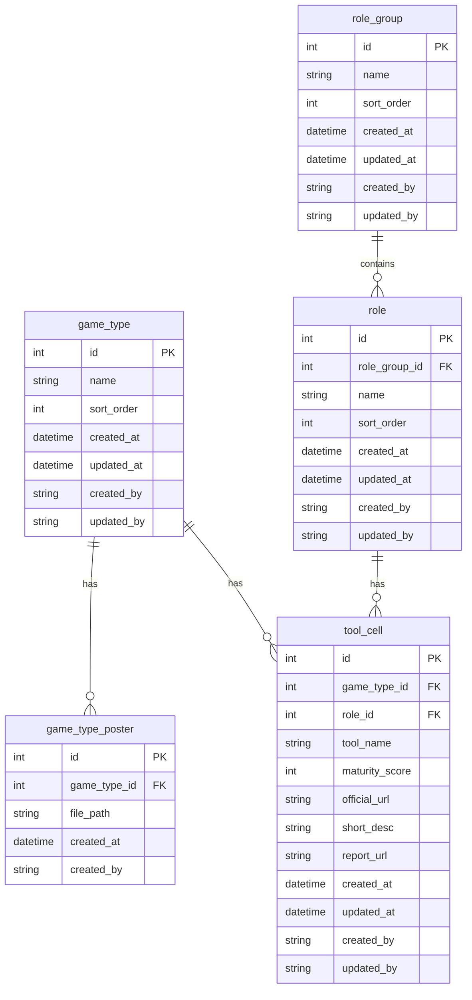

# AI 行业温度计 WebApp — 项目重启计划

## 一、架构总览




- **后端**：FastAPI + SQLAlchemy (或直接 sqlite3) + SQLite，端口 8000
- **前端**：React 19 + TypeScript + Vite + TailwindCSS，端口 5173
- **数据库**：SQLite 单文件 (`data/app.db`)
- **文件存储**：本地目录 (`data/uploads/posters/`)

## 二、与旧 PRD 的差异（精简点汇总）


| 原 PRD 内容                                                                                   | MVP 决策                         |
| ------------------------------------------------------------------------------------------ | ------------------------------ |
| 维度体系（PRD 05 全部、`dimension`/`dimension_value`/`game_type_dimension_value` 三张表、维度管理页、相关 API） | **移除**，游戏类型仅保留 `name` 字段       |
| 软删除（所有表 `is_deleted` + `deleted_at`，partial unique index）                                  | **改为硬删除**，DELETE 即物理删除         |
| 海报拖拽排序（`sort_order` 字段 + 排序 API）                                                           | **移除**，海报按上传时间排列，仅支持上传/删除      |
| `maturity_level` 离散 1-5 整数                                                                 | **改为 0-100 分数**，前端按阈值映射到 5 档颜色 |
| `created_by` / `updated_by`                                                                | **保留**，v0 填 `"system"`         |
| `maturity_config` 表                                                                        | **移除**，颜色映射纯前端实现               |
| PRD 08（存储一致性）/ PRD 09（权限审计预留）                                                              | **合并为工程实践**，不作为独立模块            |


## 三、数据模型（精简后 4 张表）




实际 5 张表：`game_type`、`game_type_poster`、`role_group`、`role`、`tool_cell`。

### maturity_score 映射规则（前端）

- 0-20 → 等级 1（红）：AI 结合程度低
- 21-40 → 等级 2（橙）：较低
- 41-60 → 等级 3（黄）：中
- 61-80 → 等级 4（黄绿）：较高
- 81-100 → 等级 5（绿）：AI 结合程度高
- 无记录 → 灰色：缺失

## 四、API 设计（FastAPI，共约 18 个端点）

**通用约定**：

- 基础路径：`/api`
- 返回格式：FastAPI 自动 JSON 序列化，无需包裹 `{ "data": ... }`
- 错误处理：HTTPException，409 用于级联阻止
- API 文档：FastAPI 自动生成 Swagger UI (`/docs`)

**端点清单**：

- `GET /api/game-types` — 列表（含关联海报）
- `POST /api/game-types` — 新增
- `PUT /api/game-types/{id}` — 编辑
- `DELETE /api/game-types/{id}` — 删除（级联检查 tool_cell + poster）
- `PUT /api/game-types/sort` — 批量排序
- `POST /api/game-types/{id}/posters` — 上传海报
- `DELETE /api/posters/{id}` — 删除海报（物理删除文件+记录）
- `GET /api/role-groups` — 列表（含子工种）
- `POST /api/role-groups` — 新增
- `PUT /api/role-groups/{id}` — 编辑
- `DELETE /api/role-groups/{id}` — 删除（级联检查 role）
- `PUT /api/role-groups/sort` — 批量排序
- `POST /api/roles` — 新增子工种
- `PUT /api/roles/{id}` — 编辑
- `DELETE /api/roles/{id}` — 删除（级联检查 tool_cell）
- `PUT /api/roles/sort` — 批量排序（组内）
- `GET /api/tool-cells` — 全量列表
- `POST /api/tool-cells` — 新增
- `PUT /api/tool-cells/{id}` — 编辑
- `DELETE /api/tool-cells/{id}` — 删除

## 五、项目目录结构（新）

```
GS_AIThermo/
├── CLAUDE.md
├── PRD/                        # 保留原始 PRD 作参考
├── backend/
│   ├── requirements.txt        # FastAPI, uvicorn, pydantic, python-multipart, aiofiles
│   ├── main.py                 # FastAPI 应用入口
│   ├── database.py             # SQLite 连接 & 建表
│   ├── models.py               # Pydantic schemas
│   ├── routers/
│   │   ├── game_types.py
│   │   ├── roles.py
│   │   └── tool_cells.py
│   └── data/                   # .gitignore，运行时创建
│       ├── app.db
│       └── uploads/posters/
├── frontend/
│   ├── package.json
│   ├── vite.config.ts
│   ├── index.html
│   ├── tailwind.config.js
│   └── src/
│       ├── main.tsx
│       ├── App.tsx
│       ├── api/                # axios 客户端 + 各模块 API
│       ├── components/         # 通用 UI 组件
│       ├── pages/              # 页面组件
│       │   ├── MatrixOverview.tsx
│       │   ├── GameTypeManagement.tsx
│       │   └── RoleManagement.tsx
│       ├── hooks/              # React Query hooks
│       ├── types/              # TypeScript 类型
│       └── utils/              # maturity 映射等工具函数
└── data/                       # 顶层 data 目录（.gitignore）
```

## 六、前端页面清单（3 个页面 + 1 个弹窗）

- **P01 矩阵总览页**（首页）：横轴游戏类型 + 纵轴工种 + 颜色矩阵网格
- **P02 游戏类型管理页**：CRUD 列表 + 拖拽排序 + 海报上传/删除
- **P03 工种管理页**：两级 CRUD 列表 + 拖拽排序
- **M01 工具卡片弹窗**：详情查看 + 新增/编辑表单

## 七、删除行为规则（硬删除 + 级联阻止）

- `game_type`：有关联 `tool_cell` 或 `poster` 时阻止删除
- `role_group`：有子 `role` 时阻止删除
- `role`：有关联 `tool_cell` 时阻止删除
- `tool_cell`：无依赖，直接删除
- `poster`：无依赖，直接删除（同步删物理文件）

## 八、实施步骤

分 3 个里程碑递进开发，每个里程碑结束后项目可运行。