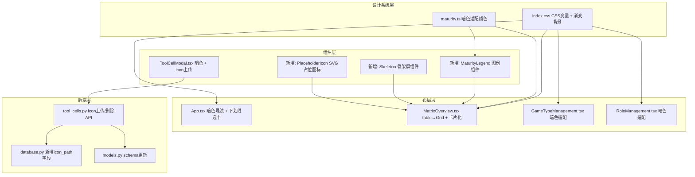

# v1 前端暗色极简重构计划

## 一、当前状态回顾

v0 已完成全部功能：

- 矩阵总览页（HTML table 实现，浅灰背景，蓝色强调色）
- 游戏类型管理页（CRUD + 拖拽排序 + 海报上传）
- 工种管理页（两级 CRUD + 拖拽排序）
- 工具卡片弹窗（查看/新增/编辑/删除）

当前设计语言：白底灰边浅色主题，`bg-gray-50` 全局背景，`bg-white` 卡片，`blue-600` 强调色，标准 HTML `<table>` 渲染矩阵。

---

## 二、用户需求整理与解读

### 需求 1：全局暗色设计语言重构

**用户原始表述**：深灰渐变背景 + 云母质感透光 + 高对比白文字 + 中灰辅助文字 + 橙金强调色

**解读与实施方案**：

建立全局 Design Token 体系，在 [frontend/src/index.css](frontend/src/index.css) 中定义 CSS 变量：

- **背景层次**（非纯黑，深灰渐变）：
  - `--bg-base`: `#121214` (最底层)
  - `--bg-surface`: `#1a1a1f` (卡片/面板)
  - `--bg-elevated`: `#242429` (浮起元素/弹窗)
  - 页面 body 使用径向渐变模拟"淡光源"效果，如从左上角发出的极淡暖白色渐变（`radial-gradient(ellipse at 15% 5%, rgba(255,250,240,0.03), transparent 60%)`）
- **文字层次**：
  - `--text-primary`: `#f0f0f2` (高对比白)
  - `--text-secondary`: `#8a8a95` (中灰辅助)
  - `--text-muted`: `#55555e` (极淡提示)
- **强调色**（偏暖橙金）：
  - `--accent`: `#e8913a`（主强调）
  - `--accent-hover`: `#f0a050`
  - `--accent-dim`: `rgba(232,145,58,0.15)`（用于下划线、badge 背景等）
- **边框/分隔**：
  - `--border`: `rgba(255,255,255,0.06)`
- **轻拟物阴影**：
  - `--shadow-card`: `0 2px 8px rgba(0,0,0,0.4), 0 1px 2px rgba(0,0,0,0.3)`
  - `--shadow-elevated`: `0 8px 32px rgba(0,0,0,0.5)`

需同步修改的核心文件：

- [frontend/src/index.css](frontend/src/index.css) — 定义 CSS 变量 + body 背景渐变
- [frontend/src/App.tsx](frontend/src/App.tsx) — 全局容器改用暗色背景
- [frontend/src/pages/MatrixOverview.tsx](frontend/src/pages/MatrixOverview.tsx) — 矩阵页
- [frontend/src/pages/GameTypeManagement.tsx](frontend/src/pages/GameTypeManagement.tsx) — 管理页
- [frontend/src/pages/RoleManagement.tsx](frontend/src/pages/RoleManagement.tsx) — 管理页
- [frontend/src/components/ToolCellModal.tsx](frontend/src/components/ToolCellModal.tsx) — 弹窗

### 需求 2：顶部导航栏重构

**用户原始表述**：短下划线选中风格（强调色）而非全部高亮，字距略大

**解读与实施方案**：

修改 [frontend/src/App.tsx](frontend/src/App.tsx) 中的导航组件：

- 导航栏背景：`--bg-surface` + 极淡底部边框（`border-b border-white/5`）
- 去掉当前的 `bg-blue-50 text-blue-700` 高亮背景
- 选中态：文字变为 `--text-primary`，底部添加 2px 宽度的短下划线（橙金色），使用 `after` 伪元素实现，下划线宽度约为文字宽度的 60%
- 未选中态：文字 `--text-secondary`，hover 时过渡到 `--text-primary`
- 字距：添加 `tracking-wider`（约 `0.05em`）
- "AI 行业温度计" 标题使用 `--text-primary` + `font-semibold`

### 需求 3：矩阵卡片化重构

**用户原始表述**：不用生冷表格，使用圆角卡片，卡片略微浮起（轻微外阴影和淡暗部渐变）

**解读与实施方案**：

重构 [frontend/src/pages/MatrixOverview.tsx](frontend/src/pages/MatrixOverview.tsx)，将 `<table>` 结构替换为 CSS Grid 布局：

- 整体使用 `display: grid`，列数 = 1（工种列）+ 游戏类型数
- 左侧工种列：sticky 定位，作为行标签
- 顶部游戏类型行：sticky 定位，作为列标签
- 每个单元格是独立的圆角卡片：
  - `border-radius: 10px`
  - 背景：`--bg-surface`（空状态）或成熟度色调渲染（有数据）
  - 浮起效果：`box-shadow: var(--shadow-card)` + 卡片内部从上到下的淡渐变（`linear-gradient(to bottom, rgba(255,255,255,0.03), transparent)`模拟光泽）
  - 卡片间距：`gap: 6px`
- 工种大类行：作为全宽分隔带，背景稍深（`--bg-base`），保留折叠/展开功能
- Hover 效果：卡片轻微上移（`transform: translateY(-1px)`）+ 阴影加深

### 需求 4：成熟度颜色体系 + 图例

**用户原始表述**：颜色分类保留，主页面添加 color code 说明，颜色变为对卡片整体颜色渲染，需保证颜色区分明显但不影响文字展示

**解读与实施方案**：

1. **颜色映射调整**（修改 [frontend/src/utils/maturity.ts](frontend/src/utils/maturity.ts)）：
  原有的 5 档颜色（红/橙/黄/黄绿/绿）在暗色主题下需要降低饱和度、提高柔和度，使其作为卡片背景时不过于刺眼：
  - 等级 1（低）：`#c0392b` → 卡片背景 `rgba(192,57,43,0.25)`
  - 等级 2（较低）：`#e67e22` → 卡片背景 `rgba(230,126,34,0.25)`
  - 等级 3（中）：`#f1c40f` → 卡片背景 `rgba(241,196,15,0.20)`
  - 等级 4（较高）：`#7fb347` → 卡片背景 `rgba(127,179,71,0.25)`
  - 等级 5（高）：`#27ae60` → 卡片背景 `rgba(39,174,96,0.28)`
  - 缺失：`--bg-surface` + 虚线边框
   卡片文字统一使用 `--text-primary`（白色高对比），保证在任何底色上都清晰可读。同时卡片左侧或底部可添加一条 3px 的实色指示条作为辅助色彩标识。
2. **Color Code 图例组件**：
  在矩阵页面顶部或右上角新增一个紧凑的图例栏：横向排列 5 个小色块 + 标签 + 灰色缺失态，如：
   `[红块] 低 (0-20) | [橙块] 较低 (21-40) | ... | [灰块] 缺失`

### 需求 5：工具 Icon 上传

**用户原始表述**：每个工具卡片支持上传 icon，未上传时显示占位 icon

**解读与实施方案**：

此需求涉及前后端改动：

**后端改动**（[backend/database.py](backend/database.py)、[backend/models.py](backend/models.py)、[backend/routers/tool_cells.py](backend/routers/tool_cells.py)）：

- `tool_cell` 表新增 `icon_path TEXT` 字段（ALTER TABLE 或重建）
- 新建 `data/uploads/icons/` 目录
- 新增 `POST /api/tool-cells/{id}/icon` 端点：接受图片上传，保存到 icons 目录，更新 `icon_path`
- 新增 `DELETE /api/tool-cells/{id}/icon` 端点：删除文件 + 置空字段
- `ToolCellOut` schema 新增 `icon_path: Optional[str]`

**前端改动**：

- [frontend/src/types/index.ts](frontend/src/types/index.ts)：`ToolCell` 接口添加 `icon_path: string | null`
- [frontend/src/components/ToolCellModal.tsx](frontend/src/components/ToolCellModal.tsx)：编辑/创建表单中添加 icon 上传区域（点击上传 / 拖拽上传），支持预览和删除
- [frontend/src/pages/MatrixOverview.tsx](frontend/src/pages/MatrixOverview.tsx)：卡片中展示 icon（20x20 圆角图标）
- **占位 icon**：使用 SVG 内联图标（例如一个简洁的立方体/工具符号），颜色为 `--text-muted`，与暗色主题一致

---

## 三、额外专业优化建议

基于对当前 UI 的审视，以下建议可显著提升整体品质：

### 建议 A：管理页面一致性适配

当前 GameTypeManagement 和 RoleManagement 页面也需要同步暗色化。建议统一组件基础样式（输入框、按钮、卡片等），避免页面切换时出现风格割裂。

### 建议 B：骨架屏 Loading

将当前的纯文字"加载中..."替换为骨架屏（Skeleton），在暗色主题下使用 `--bg-surface` 到 `--bg-elevated` 的闪烁动画，提升感知性能。

### 建议 C：弹窗动画与毛玻璃遮罩

工具卡片弹窗（ToolCellModal）当前无动画。建议添加：

- 遮罩层：`backdrop-blur(8px)` + 半透明黑色
- 弹窗入场：`scale(0.96)` + `opacity(0)` → `scale(1)` + `opacity(1)` 的 200ms 过渡

### 建议 D：矩阵页顶栏信息增强

在矩阵页面顶部（图例旁边）增加一行统计摘要，例如："共 X 个游戏类型，Y 个工种，Z 个已配置工具"——快速传达数据密度。

### 建议 E：空状态卡片交互优化

当前空单元格显示"+ 添加"文字。建议改为：

- 默认态：虚线边框圆角卡片 + 淡灰色 `+` 图标
- Hover 态：边框变为橙金色虚线 + `+` 图标变橙金色 + 轻微放大

### 建议 F：卡片 Hover 快捷操作

矩阵卡片目前只展示工具名称，用户必须点击进入弹窗才能获取更多信息。建议 hover 时在卡片上浮现一个"官网链接"跳转按钮（小型外链图标 + 文字），点击后直接在新标签页打开工具官网 URL，无需进入详情弹窗。按钮使用橙金强调色，与整体风格一致。

---

## 四、改动范围总览

## 五、实施顺序

分 5 个阶段递进实施，每阶段结束后页面可用：

1. **S1 - 设计系统基础**：CSS 变量 + 全局背景 + 导航栏暗色化
2. **S2 - 矩阵页卡片化重构**：table → CSS Grid + 圆角卡片 + 成熟度颜色渲染 + 图例
3. **S3 - 工具 Icon 功能**：后端 icon_path 字段 + 上传 API + 前端 icon 展示与上传 + 占位图标
4. **S4 - 弹窗与管理页暗色适配**：ToolCellModal + GameTypeManagement + RoleManagement 暗色化
5. **S5 - 交互体验打磨**：骨架屏 + 弹窗动画 + hover 官网跳转按钮 + 空状态优化 + 统计摘要

